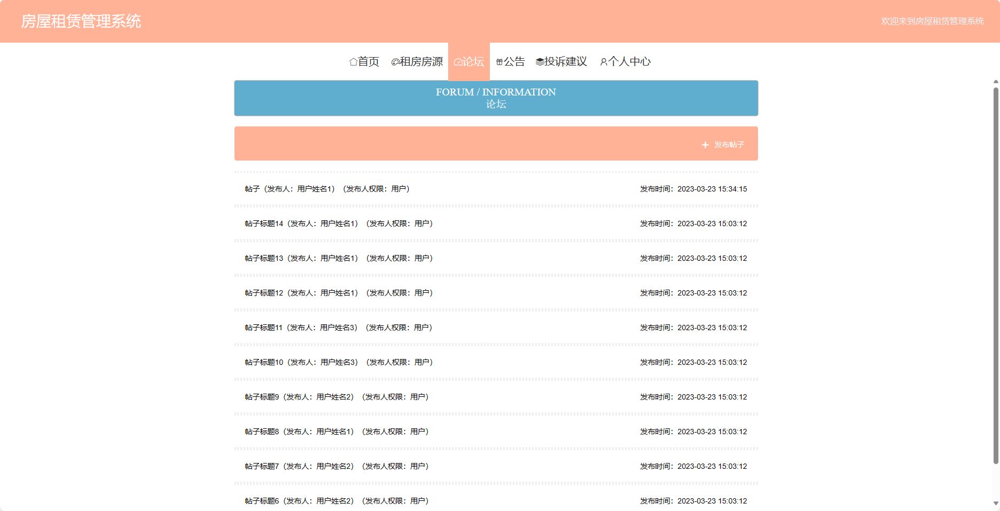
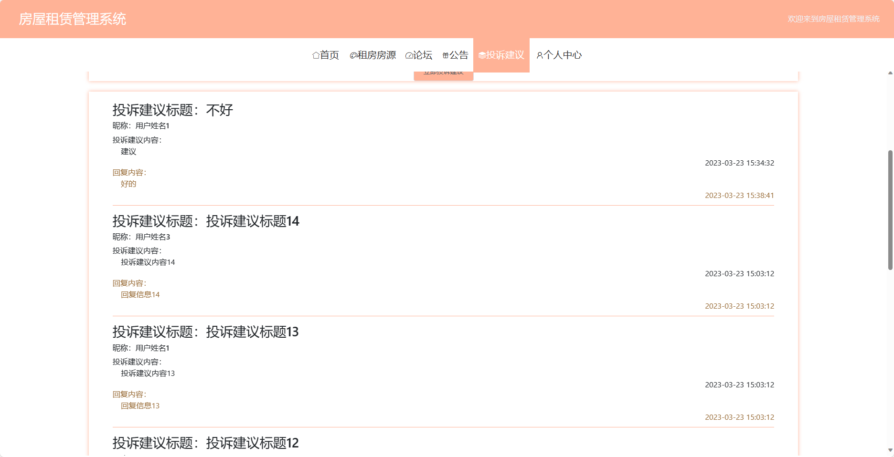
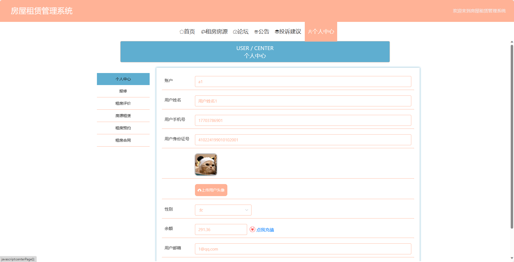
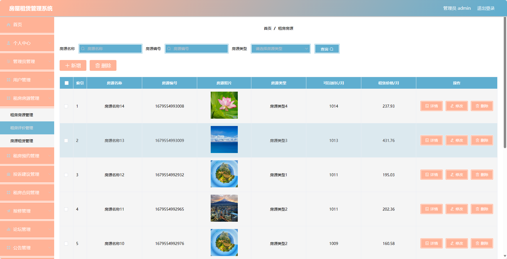
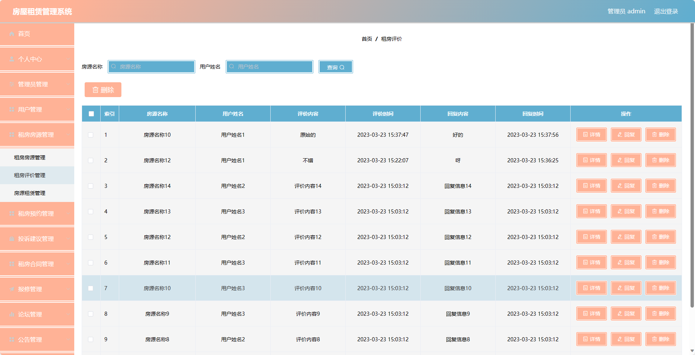
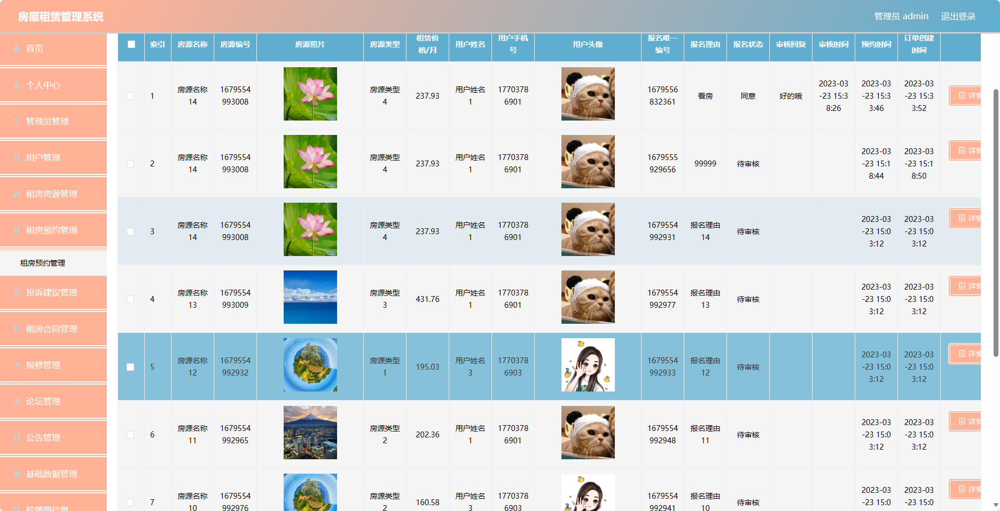
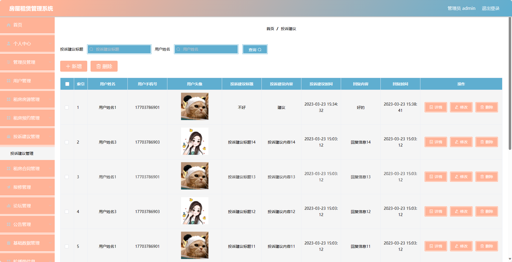

基于SpringBoot的房屋租赁管理系统（程序+论文）
=
### 完整代码获取地址：从戎源码网 ([https://armycodes.com/](https://armycodes.com/))
### 作者微信：19941326836  QQ：952045282 
### 承接计算机毕业设计、Java毕业设计、Python毕业设计、深度学习、机器学习
### 选题+开题报告+任务书+程序定制+安装调试+论文+答辩ppt 一条龙服务
### 所有选题地址https://github.com/nature924/allProject

一、项目介绍
---
基于Spring Boot框架实现的房屋租赁管理系统，系统包含两种角色：管理员、用户,系统分为前台和后台两大模块，主要功能如下。

### 前台：
1. 首页：展示平台的概况、推荐房源等信息。
2. 租房房源：展示所有的可租房源信息。
3. 论坛：提供用户之间交流的平台。
4. 公告：发布平台的公告通知。
5. 投诉建议：用户可以提交对房屋租赁服务或其他用户的投诉建议。
6. 个人中心：用户可以管理个人信息，包括修改昵称、头像等。

### 后台：
### 管理员：
1. 个人中心：管理员可以管理个人信息，包括修改密码、查看个人资料等。
2. 管理员管理：管理员可以对其他管理员进行添加、编辑、删除等操作。
3. 用户管理：管理员可以查看用户列表，对用户进行禁用、删除等操作。
4. 租房房源管理：管理员可以添加、编辑、删除房屋租赁房源信息。
5. 租房预约管理：管理员可以查看和处理用户对房屋的租赁预约申请。
6. 投诉建议管理：管理员可以查看用户的投诉建议，并进行处理和回复。
7. 租房合同管理：管理员可以管理租房合同的信息，包括新增、编辑、删除等操作。
8. 报修管理：管理员可以处理用户对房屋报修的请求，并跟踪报修进度。
9. 论坛管理：管理员可以管理论坛的帖子，包括审核、编辑、删除等操作。
10. 公告管理：管理员可以发布平台公告，通知用户关于租赁政策、活动等信息。
11. 基础数据管理：管理员可以管理系统的基础数据，包括分类管理、地区管理等。
12. 轮播图信息：管理员可以设置首页轮播图的图片及链接。
密码、姓名、性别、手机、邮箱、照片和备注等。

二、项目技术
---
- 编程语言：Java
- 数据库：MySQL
- 项目管理工具：Maven
- 前端技术：VUE、HTML、Jquery、Bootstrap
- 后端技术：Spring、SpringMVC、MyBatis

三、运行环境
---
- 操作系统：Windows、macOS都可以
- JDK版本：JDK1.8以上都可以
- 开发工具：IDEA、Ecplise、Myecplise都可以
- 数据库: MySQL5.7以上都可以
- Tomcat：任意版本都可以
- Maven：任意版本都可以

四、运行截图
---
### 论文截图：
![image/1.png]
![image/1.png]

### 程序截图：

